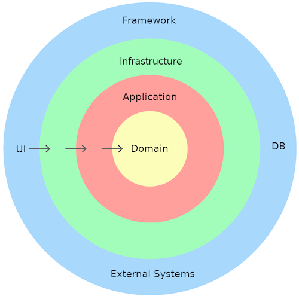

# Tutorial API dotnet core 6

Baseado no tutorial "Criando uma API robusta em dotnet core 6" do canal Manual do Programador. Link: https://www.youtube.com/watch?v=ufjRbiaoou4&list=PLP4r6dpm_h-vPhZ-OXz3B5dcKpohAjhUE.

## Seções:
- Softwares utilizados
- Estrutura do projeto
- Criação das entidades
- Criação do banco de dados SQL Server
- DbContext e mapeamento de entidades
- Repositories
- DTOs
- Services
- Injeção de dependências
- Controllers
- Paginação
- Transação
- Autenticação JWT

## Softwares utilizados
SDK do dotnet 6. Link para instação: https://dotnet.microsoft.com/en-us/download

VS code. Link: https://code.visualstudio.com/download

Extensões do vscode: 
- C#: obrigatório pra compilar projetos em C#.
- C# Extensions: praticidade para criar novas classes, interfaces, controllers, etc. em C#.
- C# snippets: snippets úteis para C#.
- vsode-solution-explorer: facilita o trabalho com as solutions (adicionar referências, etc.).

SQL Server 2017. Link: https://www.microsoft.com/pt-br/sql-server/sql-server-downloads

SQL Server Management Studio 18. Link: https://learn.microsoft.com/en-us/sql/ssms/download-sql-server-management-studio-ssms?view=sql-server-ver16
## Estrutura do projeto
Uma boa arquitetura é vital para construir aplicações escaláveis, modulares e de fácil manutenção. Esse projeto utiliza a arquitetura "Clean code" (ou arquitetura limpa), que tem como principais benefícios ser:
- Independente do banco de dados e dos frameworks utilizados.
- Independente da camada de UI (interface do usuário).
- Altamente testável.

Esse padrão é constituído basicamente de 4 camadas principais:
- Domain
- Application
- Infrastructure
- Framework

No VSCode, foi utlizado o console para criação dos projetos. Inicialmente, criou-se um:

`dotnet new `

Fonte: https://www.c-sharpcorner.com/article/introduction-to-clean-architecture-and-implementation-with-asp-net-core/
## Criação das entidades
Os modelos são as classes responsáveis por representar as tabelas do banco de dados. Para isso, (...)
## Criação do banco de dados em SQL Server
Para a criação do banco SQL Server, (...)
## DbContext e mapeamento de entidades
O DbContext é a classe responsável por fazer a comunicação direta com o banco de dados. (...)
## Repositories
A camada de repositório contem os métodos de consulta e alteração do banco de dados. (...)
## DTOs
Data Transfer Objects (DTO) são objetos que representam (...)
## Services
A camada services contém as regras de negócio (...)
## Injeção de dependências
O pattern de injeção de dependência (dependency injection) é utilizado para (...)
## Controllers
A camada de controllers é a camada que permite ao usuário se comunicar com a API através do protocolo HTTP (...)
## Paginação
Para se fazer uma busca dos registros do banco e não sobrecarregar o usuário com excesso de dados, recomenda-se a utilização da busca paginada (...)
## Transação
Existem casos nos quais uma requisição modifica o banco de dados mais de uma vez. Nesse caso, a aplicação pode modificar algumas tabelas no banco e ocorrer um erro no meio do caminho, ocasionando dados errados. Para isso, (...)
## Autenticação JWT
Para restringir o acesso de métodos a certos usuários cadastradaos (...)